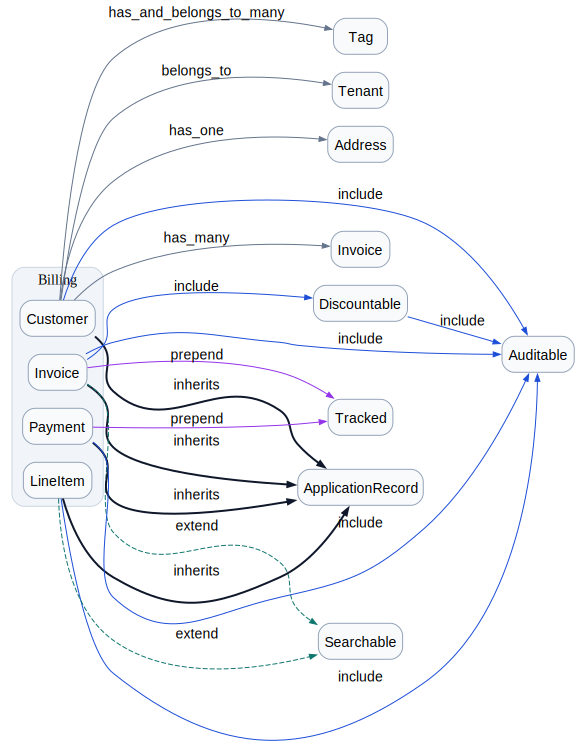

# rigor-module-graph

Class/module/constant dependency graph for Ruby projects, built on
[Rigor](https://rigor.typedduck.fail/). The class-level counterpart
to Packwerk/Graphwerk: where those look at package boundaries, this
looks at the Ruby nominal graph — inheritance, `include`/`prepend`/
`extend`, and (later) constant references.



The screenshot above is from `examples/billing/`. Open
`examples/billing/index.html` for the live Mermaid version.

## Status

- **Phase 1 (MVP)**: `inherits` / `include` / `prepend` / `extend`
  edges, DOT / Mermaid / cycles output, dedup, Rigor-driven AST walk.
- Phase 2 (Rails path / Zeitwerk owner inference) and Phase 3
  (Rigor type info for indirect refs) are planned; see `plan.md`.

## Installation

```ruby
# Gemfile
gem "rigor-module-graph"
gem "rbs", "~> 4.0"  # rigortype 0.2.x needs rbs 4.x; Ruby 4.0 ships 3.10
```

```sh
bundle install
```

The `rbs ~> 4.0` pin matters: rigortype calls
`RBS::Environment::ClassEntry#each_decl`, which only exists in
rbs 4.x. The Ruby 4.0 stdlib bundles rbs 3.10, so without the pin
the analyzer falls over on the first file.

## Configuration

Add the plugin to your project's `.rigor.yml`:

```yaml
target_ruby: '4.0'
paths:
  - app
  - lib
plugins:
  - gem: rigor-module-graph
```

## Usage

Three reader subcommands and one collector:

```sh
# Run `rigor check` and write edges JSONL (default: .rigor/module_graph/edges.jsonl)
bundle exec rigor-module-graph collect

# Render the graph
bundle exec rigor-module-graph dot     .rigor/module_graph/edges.jsonl > graph.dot
bundle exec rigor-module-graph mermaid .rigor/module_graph/edges.jsonl > graph.mmd
dot -Tsvg graph.dot -o graph.svg

# Detect cycles (exit 1 if any are found)
bundle exec rigor-module-graph cycles  .rigor/module_graph/edges.jsonl
bundle exec rigor-module-graph cycles --only include,inherits edges.jsonl
```

`collect` shells out to `rigor check --format json --no-cache` and
filters diagnostics on `source_family == "plugin.module-graph"` +
`rule == "edge"`, so re-running is deterministic and there's no
on-disk side-effect from the plugin itself.

`dot` / `mermaid` / `cycles` accept a file argument or read stdin.

## Edge format

Each edge in the JSONL file looks like:

```json
{"from":"Billing::Invoice","to":"ApplicationRecord","kind":"inherits","path":"app/models/billing/invoice.rb","line":2,"column":3,"confidence":"syntax"}
```

- `kind`: `inherits` / `include` / `prepend` / `extend` /
  `const_ref` (the last one is reserved for Phase 2).
- `confidence`: `syntax` / `zeitwerk` / `rigor_type` /
  `unresolved`. MVP only emits `syntax`.

The renderers dedup by `(from, to, kind, confidence)` so two
`include Foo` on the same class across files collapse to one edge.

## Development

```sh
bundle install
bundle exec rake test
UPDATE_SNAPSHOTS=1 bundle exec rake test   # to refresh snapshots
```

The test suite covers:

- `ConstantName`, `Edge`, `Analyzer`, `CycleDetector` as unit tests
- `Dot`, `Mermaid` rendering via `minitest-snapshot`
- An integration test that boots the real `rigor` binary against
  `test/fixtures/rails_app/` and snapshots the edges JSONL

## Compatibility

- Ruby `>= 4.0.0, < 4.1`
- rigortype `~> 0.2.1`
- rbs `~> 4.0`
